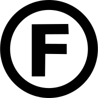

# Structure

Severn project structure.

## Conduct

Respect agency. Follow the [Code of Conduct](CODE_OF_CONDUCT.md).

## Waiver

Anybody caught using this work without our permission, will be mighty good friends of ourn, cause we don't give a dern. Study it. Hack it. Publish it, even without naming the source. We made it, that's all we wanted to do.

NO rights reserved. A [free work](https://freedomdefined.org/Definition). [Copyfree](http://copyfree.org/). Released under the [zero clause BSD license](https://opensource.org/licenses/FPL-1.0.0).

<!-- markdownlint-disable MD033 -->

<!-- markdownlint-enable MD033 -->